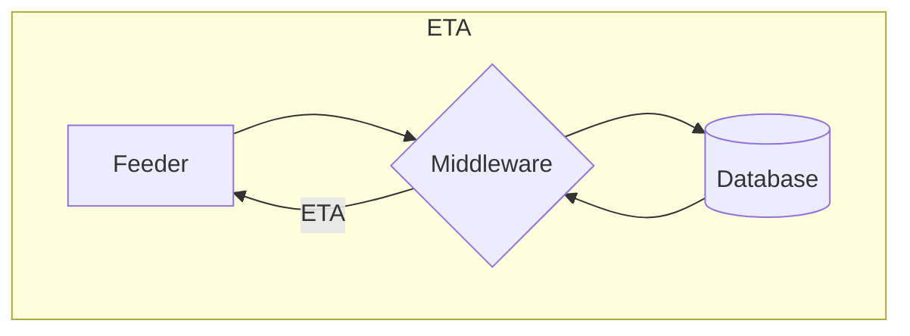
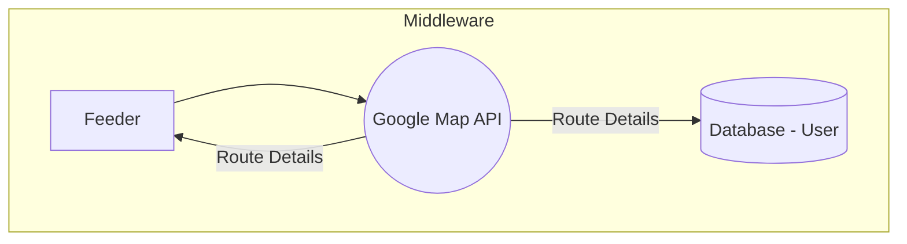

# Database Design

```mermaid
graph TD
subgraph ETA
A[Feeder]  --> C{Middleware}
C --> B
B[(Database)] --> C
C -- ETA --> A
end
```

```mermaid
flowchart TD
subgraph Middleware
A[Feeder] --> B((Google Map API))
B -- Route Details --> C[(Database - User)]
B -- Route Details --> A 
end
```

```mermaid
 flowchart LR
 
```
<!--stackedit_data:
eyJoaXN0b3J5IjpbMTcyNjcwOTc2N119
-->