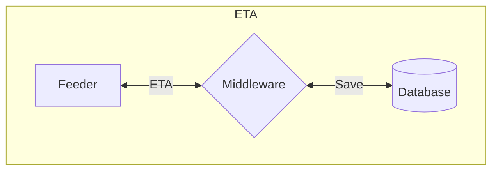
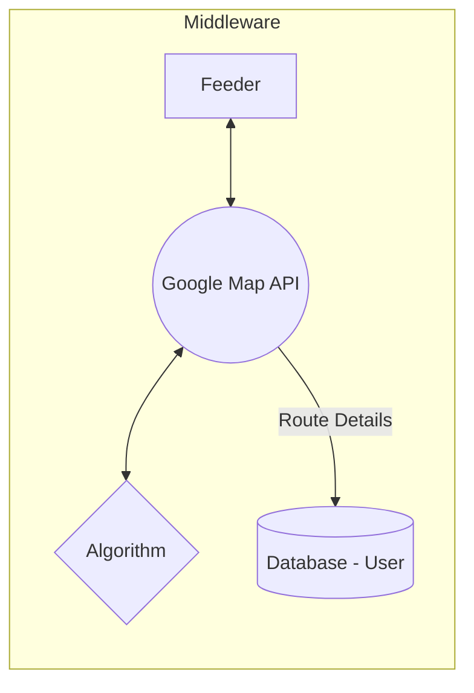
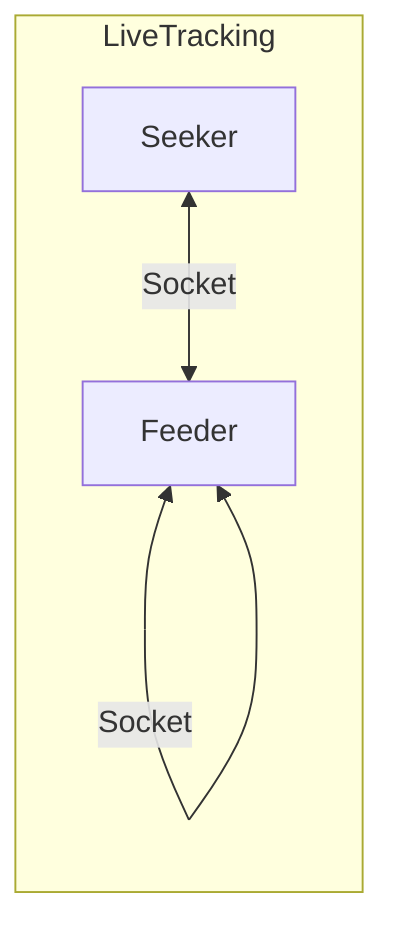

# Database Design

```mermaid
flowchart TD
subgraph ETA
A[Feeder] <--ETA--> C{Middleware}
C <--Save--> B[(Database)]
end
```

```mermaid
flowchart LR
subgraph Middleware
A[Feeder] <--> B((Google Map API))
B <--> D{Algorithm}
B -- Route Details --> C[(Database - User)]
end
```

```mermaid
 flowchart LR
 subgraph LiveTracking
 A[Seeker] <--Socket--> B((GPS))
 B[Feeder] <--Socket--> B
 end
```
<!--stackedit_data:
eyJoaXN0b3J5IjpbLTU1MjIyMTc3Nyw1NDE4NTc4MTAsLTE1Mz
k2ODAyNzIsMTY2MzA1ODQyMCwxNzI2NzA5NzY3XX0=
-->