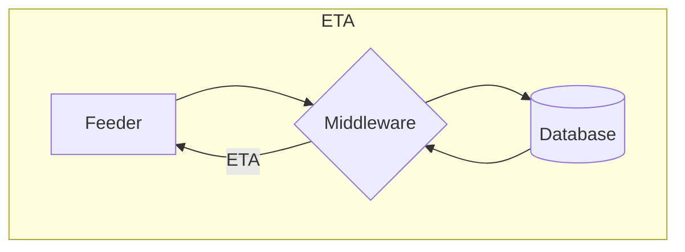
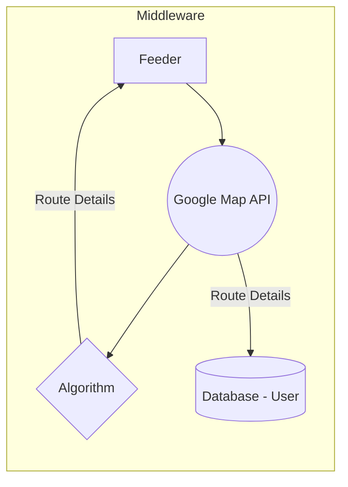

# Database Design

```mermaid
graph TD
subgraph ETA
A[Feeder]  --> C{Middleware}
C --> B
B[(Database)] --> C
C -- ETA --> A
end
```

```mermaid
flowchart LR
subgraph Middleware
A[Feeder] --> B((Google Map API))
B --> D{Algorithm}
B -- Route Details --> C[(Database - User)]
D -- Route Details --> A 
end
```

```mermaid
 flowchart LR
 subgraph 
```
<!--stackedit_data:
eyJoaXN0b3J5IjpbMTY2MzA1ODQyMCwxNzI2NzA5NzY3XX0=
-->