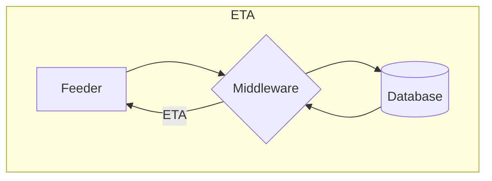
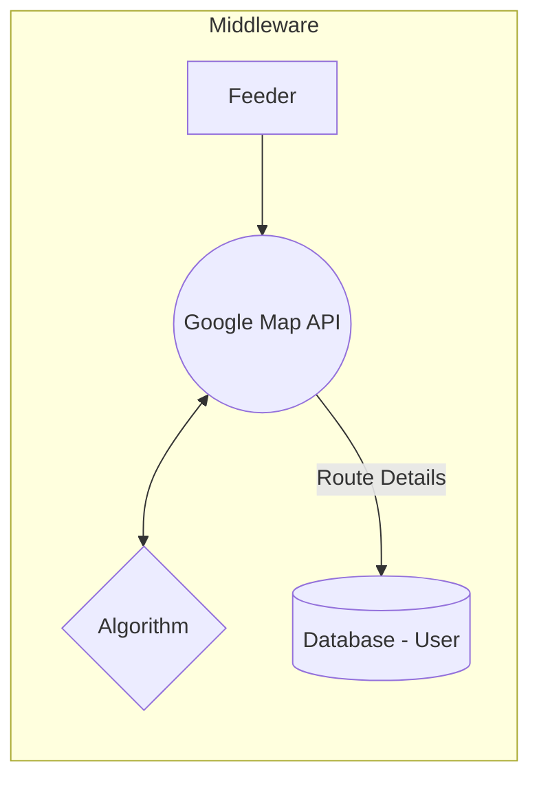

# Database Design

```mermaid
graph TD
subgraph ETA
A[Feeder]  --> C{Middleware}
C --> B
B[(Database)] --> C
C -- ETA --> A
end
```

```mermaid
flowchart LR
subgraph Middleware
A[Feeder] --> B((Google Map API))
B <--> D{Algorithm}

B -- Route Details --> C[(Database - User)]

end
```

```mermaid
 flowchart LR
 subgraph 
```
<!--stackedit_data:
eyJoaXN0b3J5IjpbMTI0NzY0NzY1OCwxNjYzMDU4NDIwLDE3Mj
Y3MDk3NjddfQ==
-->