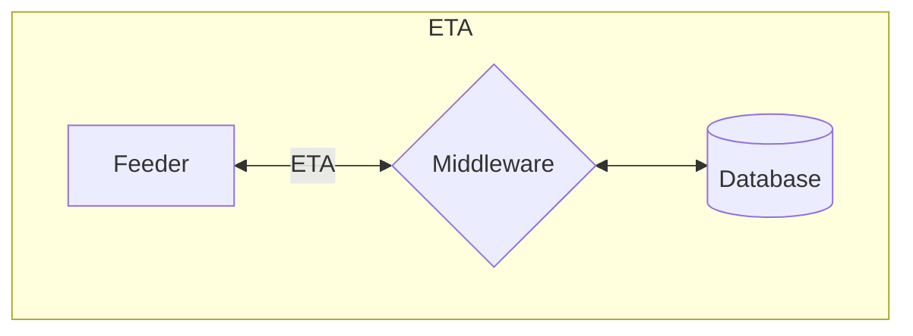
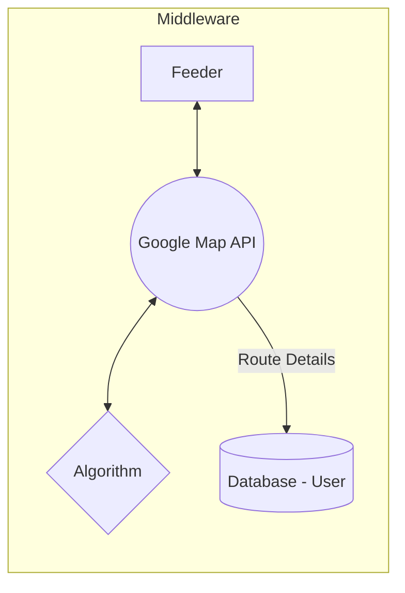

# Database Design

```mermaid
graph
subgraph ETA
A[Feeder] <--ETA--> C{Middleware}
C <--> B[(Database)]
end
```

```mermaid
flowchart LR
subgraph Middleware
A[Feeder] <--> B((Google Map API))
B <--> D{Algorithm}

B -- Route Details --> C[(Database - User)]

end
```

```mermaid
 flowchart LR
 subgraph 
```
<!--stackedit_data:
eyJoaXN0b3J5IjpbMTQwMjIzNjE4MywxNjYzMDU4NDIwLDE3Mj
Y3MDk3NjddfQ==
-->