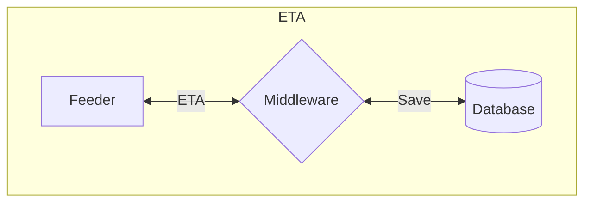
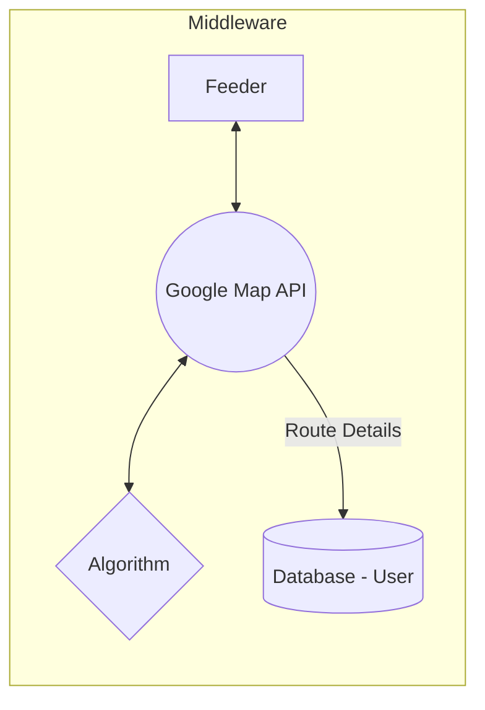

# Database Design



```mermaid
 flowchart LR
 subgraph LiveTracking
 A[Seeker] --> B[]
 end
```
<!--stackedit_data:
eyJoaXN0b3J5IjpbNTQxODU3ODEwLC0xNTM5NjgwMjcyLDE2Nj
MwNTg0MjAsMTcyNjcwOTc2N119
-->