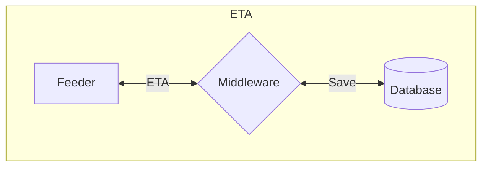
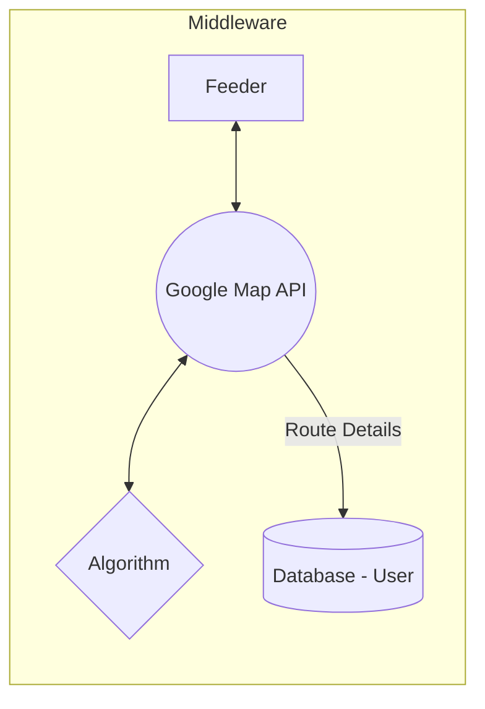
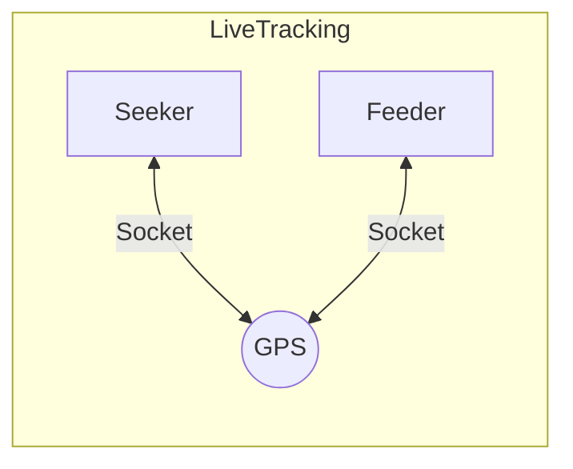

# Database Design

```mermaid
flowchart TD
subgraph ETA
A[Feeder] <--ETA--> C{Middleware}
C <--Save--> B[(Database)]
end
```

```mermaid
flowchart LR
subgraph Middleware
A[Feeder] <--> B((Google Map API))
B <--> D{Algorithm}
B -- Route Details --> C[(Database - User)]
end
```

```mermaid
 flowchart LR
 subgraph LiveTracking
 A[Seeker] <--Socket--> B((GPS))
 C[Feeder] <--Socket--> B
 end
```
<!--stackedit_data:
eyJoaXN0b3J5IjpbLTUzMTg4NDQwMiwtNDE0NjM4NTk2LDU0MT
g1NzgxMCwtMTUzOTY4MDI3MiwxNjYzMDU4NDIwLDE3MjY3MDk3
NjddfQ==
-->